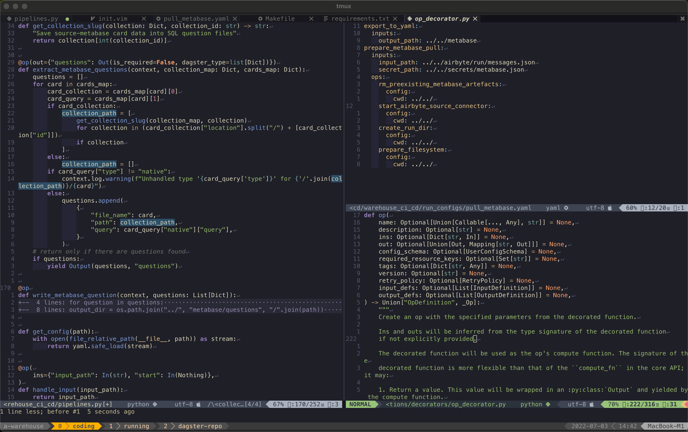
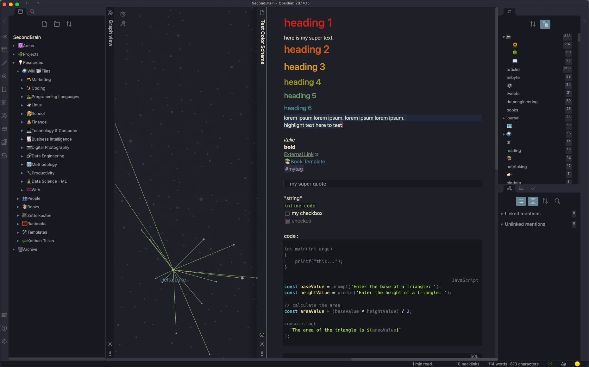

Dotfiles
========
These are my dotfiles that I'm constantly tweaking. I enjoy nvim and try to optimize my dev workflow as much as possible. 
In the end, it should be fun to use.

## nvim, tmux and kitty

Used in this screenshot:
* Color Theme [Kanagawa](https://github.com/rebelot/kanagawa.nvim) (mix between [gruvbox](https://github.com/morhetz/gruvbox) and [tokyonight](https://github.com/folke/tokyonight.nvim)!). Announced [here](https://www.reddit.com/r/neovim/comments/rm92q6/kanagawanvim_if_gruvbox_and_tokyonight_had_a_baby/) on reddit.
* Editor ([PDE](https://youtu.be/QMVIJhC9Veg)): [NeoVim](https://neovim.io/)
* Indent-color with [indent-blankline](https://github.com/lukas-reineke/indent-blankline.nvim)
* Tabs for buffers with [bufferline](https://github.com/akinsho/bufferline.nvim)
* Terminal Multiplexer: [Tmux](https://github.com/tmux/tmux/wiki)
* Terminal: [Kitty](https://github.com/tmux/tmux/wiki)

## [Obsidian](https://github.com/sspaeti/dotfiles/tree/master/obsidian) with [Kanagawa](https://github.com/sspaeti/obsidian_kanagawa) theme:

