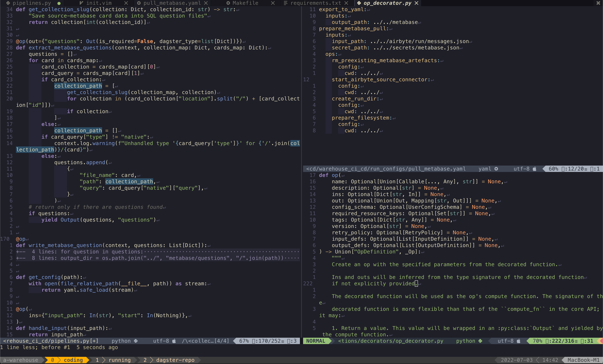
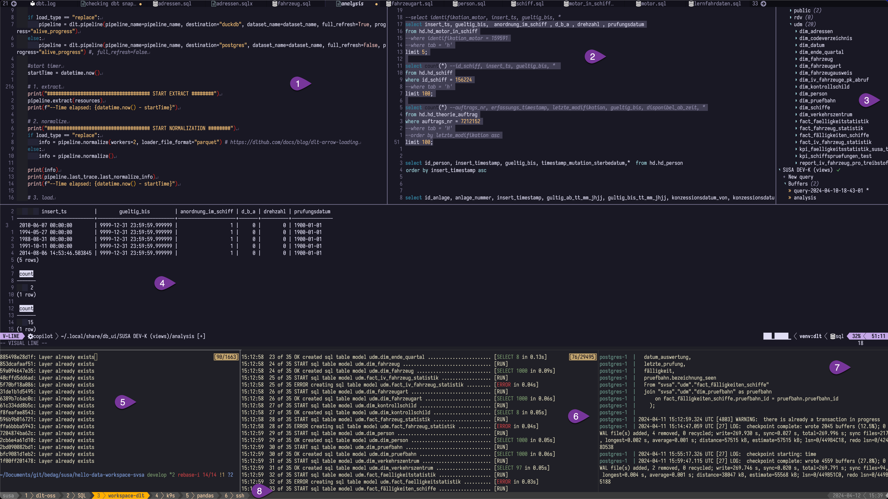
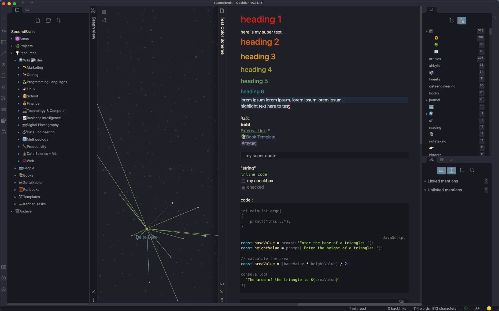

# Dotfiles

Welcome to my dotfiles, the backbone of my development, backed by my [vim workflow](https://www.ssp.sh/blog/my-vimverse/), [PKM workflow](https://www.ssp.sh/blog/pkm-workflow-for-a-deeper-life/) or [Obsidian workflow](https://www.ssp.sh/blog/obsidian-note-taking-workflow/).

The dotfile here are fine-tuned to create an environment that's efficient for me, and, most importantly, give me joy workin in. Check out the details below.




## Key Components
- **OS** Linux with [Omarchy](https://omarchy.org) (since July 2025, before macOS)
- **Window Manager** [Hyprland](https://hypr.land/) (before `skhd` and `yabai`)
- **Editor / [PDE](https://youtu.be/QMVIJhC9Veg)**: [NeoVim](https://neovim.io/)
- **Color Theme**: [Kanagawa](https://github.com/rebelot/kanagawa.nvim) (mix between [gruvbox](https://github.com/morhetz/gruvbox) and [tokyonight](https://github.com/folke/tokyonight.nvim)!). Announced [here](https://www.reddit.com/r/neovim/comments/rm92q6/kanagawanvim_if_gruvbox_and_tokyonight_had_a_baby/) on reddit
- **Multiplexer**: [Tmux](https://github.com/tmux/tmux/wiki)
- **Window Management**: Yabai, Skhd and Mission Control shortcuts for seamless navigation (more below)
- **Terminal**: [Kitty](https://github.com/kovidgoyal/kitty), Ghostty
- **Note-Taking**: [Obsidian](https://ssp.sh/brain/obsidian), where my Second Brain thrives

#### Terminal Powered Workflow [[More Images](https://www.ssp.sh/brain/neovim/#my-setup-images)]


In one screen:
1. data integration/dbt code
2. analysis of SQL queries
3. db connections/browser
4. result of queries
5. docker build
6. dbt run
7. postgres
8. more windows/sessions (Tmux)


## Screen alignment

I have tried [many setups](https://www.ssp.sh/brain/computer-desk-setup-todays-office/), a single-screen (or one extra for meetings) has worked best with these shorcuts to switch betweent them instantly:

- `Alt+1`: Terminal for coding
- `Alt+2`: Obsidian for notes, thinking, writing, and my [Second Brain](https://www.ssp.sh/brain/) ([GitHub](https://github.com/sspaeti/second-brain-public))
- `Alt+3`: Browser for research and browsing needs
- `Alt+4`: Music, featuring Spotify and Focus@Will for all things auditory
- `Alt+5`: Collaboration tools like Slack, Asana, Nirvana, and my to-do lists
- `Alt+6`: Extra (when laptop screen is open): Additional screens for meetings with Zoom, etc.
- `Alt+7`: Extra (when laptop screen is open)

## [Obsidian](https://www.ssp.sh/brain/obsidian) 



I made two of my own Themes, they are called [Kanagawa](https://github.com/sspaeti/obsidian_kanagawa) and [Rosé Pine](https://github.com/sspaeti/obsidian_rose_pine).
Also check my YT video [How I use Obsidian](https://youtu.be/myHKHM2mIis), in case that's interest you.


### Neovim as a Word Processor

For my Micro Journal I converted my Neovim config to a minimal config soley for writing. My goal was to reproduce my Obsidian environment within Neovim, running on a small, distraction-free typewriter.
See all details in [Neovim as a WordProcessor](./nvim-wp/)

## Installation

I use [Stow](https://www.gnu.org/software/stow/) to manage my dotfiles. I created a [Makefile](Makefile) to stow them for Mac and Linux respectively. But I'd suggest to not blindly run them, but rather choose and pick what you like from my dotfiles.

But you can run `make linux` and it will stow all shared + linux dotfiles I set. But you can also just install one specific dotfile with `stow nvim` for my Neovim installation. Please check the docs for further information how it works.

My setup is I clone this dotfiles repo in `~/git/general/dotfiles` and in `~/.stowrc` I set the target stow directory to `--target=/home/sspaeti` as the default stow target is the partent directory which in my case would be wrong (general-dir).

### Operation System
I used MacOS 15+ years, Windows at work and now [Arch Linux with Omarchy](https://www.ssp.sh/blog/macbook-to-arch-linux-omarchy/). 

I have all settings in one folder with stow, except Windows. It's in it's own folder under [Windows directory](windows) .

## Others

### Oh-my-zsh

Check [latest](https://ohmyz.sh/#install):
```sh
sh -c "$(curl -fsSL https://raw.githubusercontent.com/ohmyzsh/ohmyzsh/master/tools/install.sh)"
```

## Copy files over

### Allow ssh on old Linux computer

```
sudo systemctl enable --now sshd
```

### Obsidian
activate sync, and create symlinks blog, writing, etc.
check settings and appearance, eventough .obsidian is moved, they don't take the settings
-> I didn't stow all the themes etc. I think? -> use obsidian sync for that

### Copy files over

```
rsync -avy --progress sspaeti@192.168.1.18:~/.ssh ~/
rsync -avy --progress sspaeti@192.168.1.18:~/.dotfiles/zsh/secrets ~/.dotfiles/zsh/secrets
rsync -avy --progress sspaeti@192.168.1.18:~/.local/share/zoxide ~/.local/share/
rsync -avy --progress sspaeti@192.168.1.18:~/.local/share/kdenlive ~/.local/share/
rsync -avy --progress sspaeti@192.168.1.18:~/.local/bin ~/.local/
rsync -avy --progress sspaeti@192.168.1.18:~/Simon ~/
rsync -avy --progress sspaeti@192.168.1.18:~/git ~/git/
rsync -avy --progress sspaeti@192.168.1.18:~/Documents/ ~/Documents/
rsync -avy --progress sspaeti@192.168.1.18:~/Downloads/ ~/Downloads/
rsync -avy --progress sspaeti@192.168.1.18:~/Videos/ ~/Videos/
rsync -avy --progress sspaeti@192.168.1.18:~/Pictures/ ~/Pictures/
```

### Keyboard Kanata

```
make install-kanata
```
and 

Add `/etc/sudoers.d/00_sspaeti` see [readme kanata](kanta/.config/kanata/readme.md)

### sudo time out password
TODO update X-times wrong password and how long until I can re-enter

### Tmux

After stowing tmux, run this command to ensure clean plugin installation:
```
rm -rf ~/.tmux/plugins && tmux new-session -d && tmux kill-session
```
Then open tmux and press `Ctrl+t` + `I` to install all plugins.

If you see "tmux resurrect file not found" errors, press `Ctrl+t` + `Ctrl+s` to save a session first.
### Manual
- GIMP: ctrl + del shortcut
- ..
- document all special setups here. Can this be automated/copies with ~/.loca/state/? or .local/share?

### Finalize

Turn off ssh again:

```
sudo systemctl stop sshd
```
