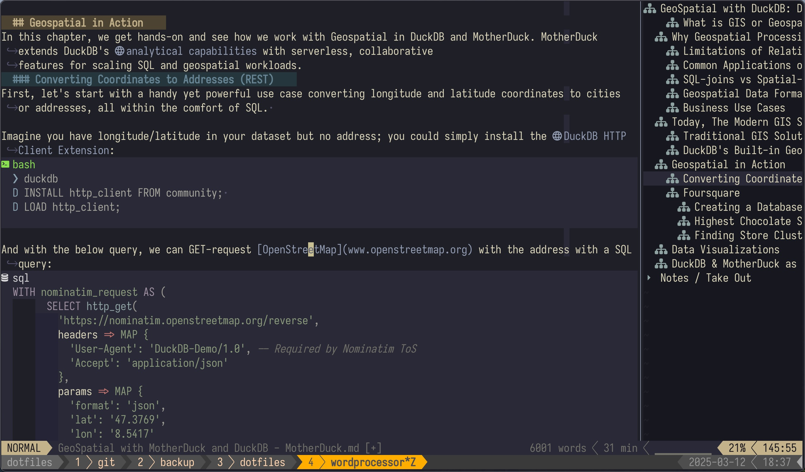
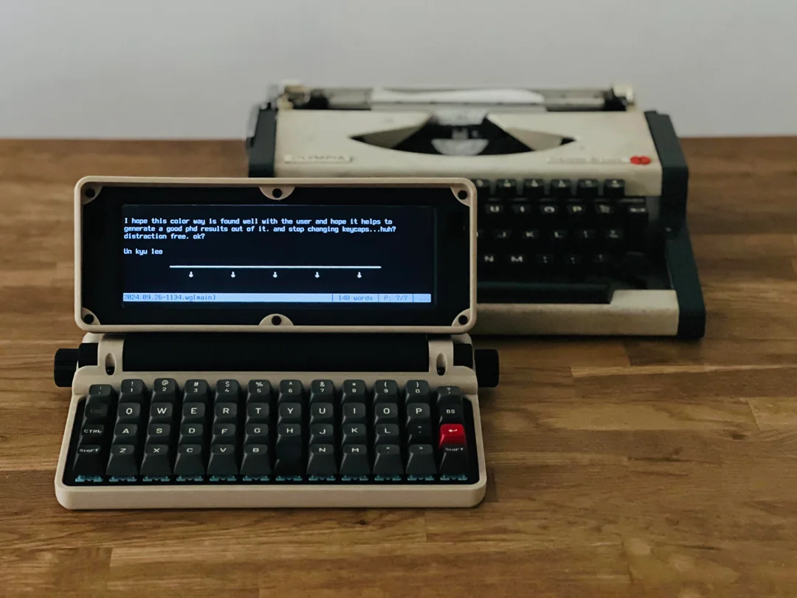

# Neovim as a WordProcessor for Micro Journal (Debian, tty, low power)

This config is Neovim configured to act as a classical wordprocessor to write text and especially markdown.

### Default with Outline
 

### Micro Journal
This markdown optimized config will be used on a [Micro Journal](https://github.com/unkyulee/micro-journal) device, a modern distraction-free type writer.

 

