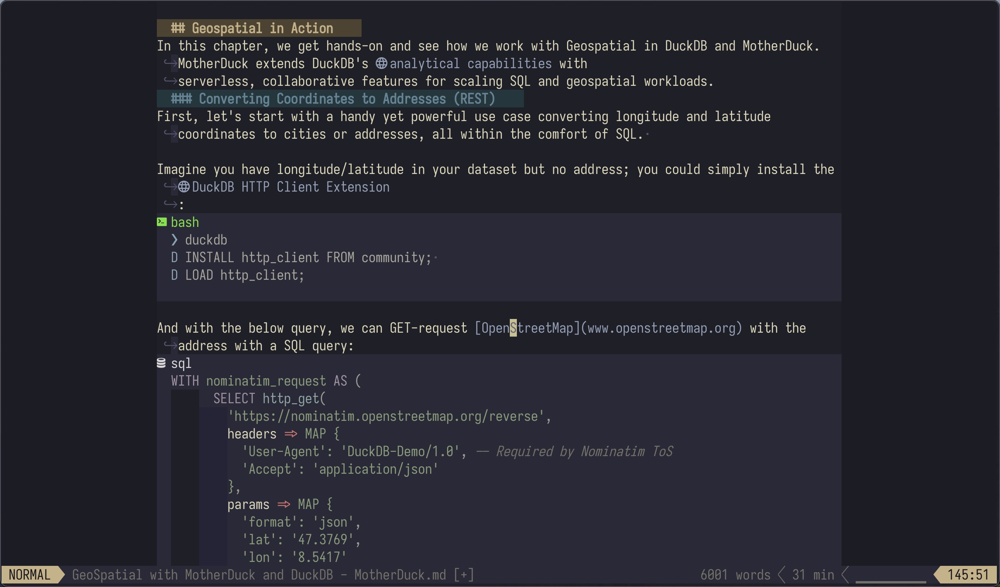
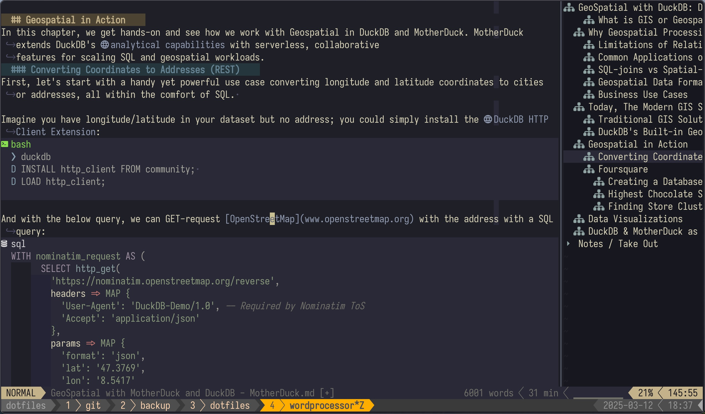

# Neovim as a WordProcessor

This config is Neovim configured to act as a classical wordprocessor to write text and especially markdown.

Move this config to `~/.config/nvim` after you installed neovim (see `make install`  in [/install](/install) directory).


### Zen Mode
 

> **Note**: Activate `zen-mode` with `leader+z` to get into the focus mode. This will center text, hide tmux when active, and many more.
### Default with Outline
 

### Micro Journal

Debian, low-power and tty (low color) nvim dotfiles are in [micro-journal/configs/nvim](../micro-journal/configs/nvim). This folder here `nvim-wp` is the wordprocessor on a high-power or normal laptop.


## Font
I was searching for a font for writing and reading optimized, but still compatible with the terminal (mono-space). As I use Iosevka already for programming, I am trying **Iosevka Etoiole**.

Install 
```sh
# Install Iosevka Etoile Font for Terminal Writing

# 1. Install required tools
sudo apt update 
sudo apt install curl jq unzip

# 2. Create temporary directory and move to it
mkdir -p ~/temp/fonts && cd ~/temp/fonts

# 3. Download latest Iosevka Etoile package
curl -s 'https://api.github.com/repos/be5invis/Iosevka/releases/latest' | \
  jq -r ".assets[] | .browser_download_url" | \
  grep PkgTTC-IosevkaEtoile | \
  xargs -n 1 curl -L -O --fail --silent --show-error

# 4. Extract the font files
unzip PkgTTC-IosevkaEtoile-*.zip

# 5. Create font directory (user-level installation)
mkdir -p ~/.local/share/fonts/iosevka-etoile

# 6. Copy font files to your fonts directory
cp ttc/*.ttc ~/.local/share/fonts/iosevka-etoile/

# 7. Update the font cache
sudo fc-cache -f -v

# 8. Verify installation (should show Iosevka in the output)
fc-list | grep Iosevka

# 9. Clean up temporary files
cd ~
rm -rf ~/temp/fonts
```


### Using in Terminal
- Open your terminal preferences
- Select "Iosevka Etoile" from the font dropdown
- Adjust the size to your preference (recommended: 12-14pt)
### Why Iosevka Etoile?
Iosevka Etoile offers:

- Serif-inspired letterforms that are easy on the eyes for long-form writing
- Terminal compatibility with monospaced alignment
- Narrow width allowing more text on screen
- Elegant aesthetic while maintaining technical requirements

Alternative would be **Iosekvka Aile**.
